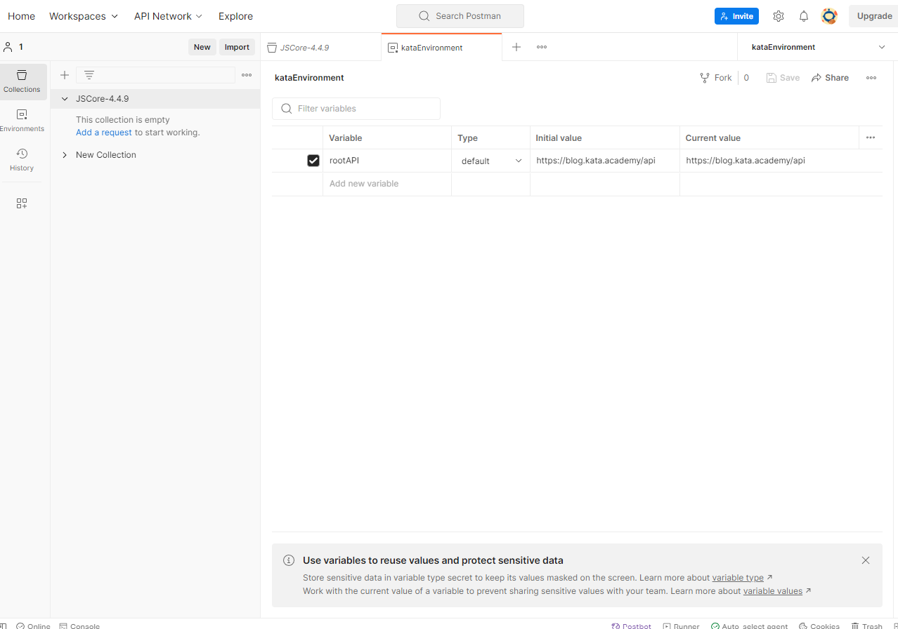
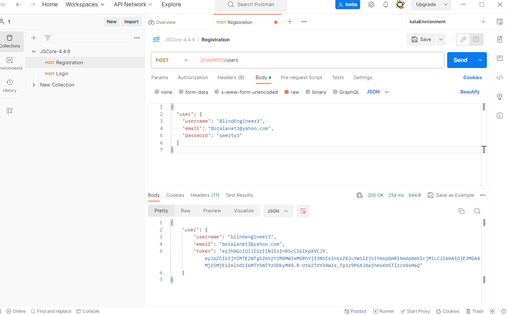
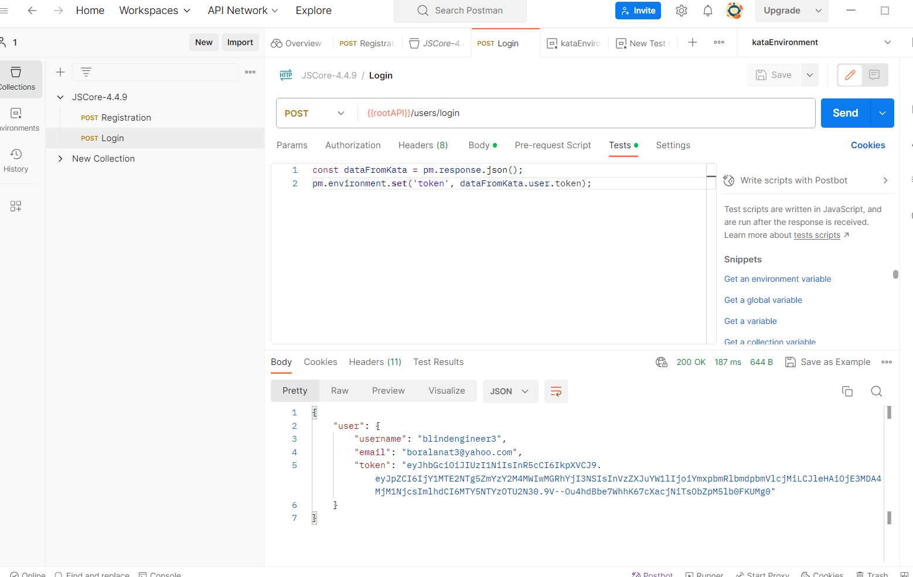
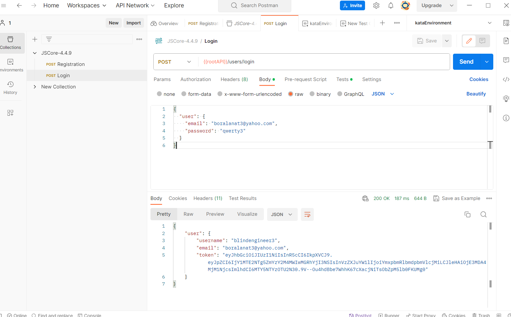
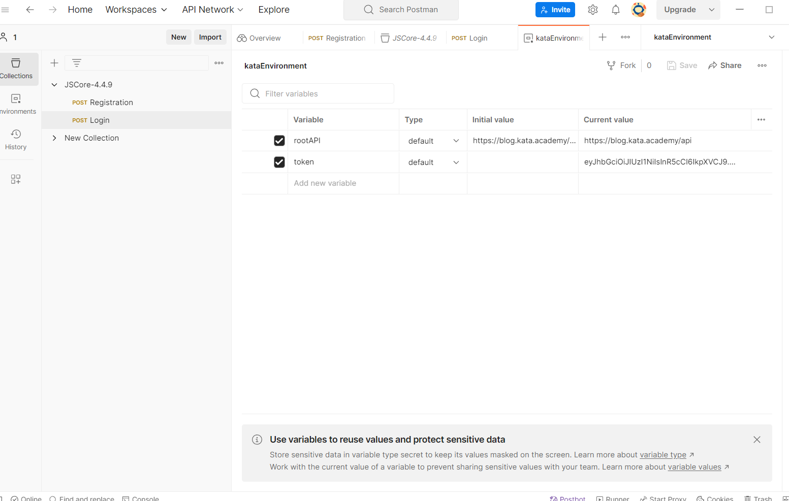
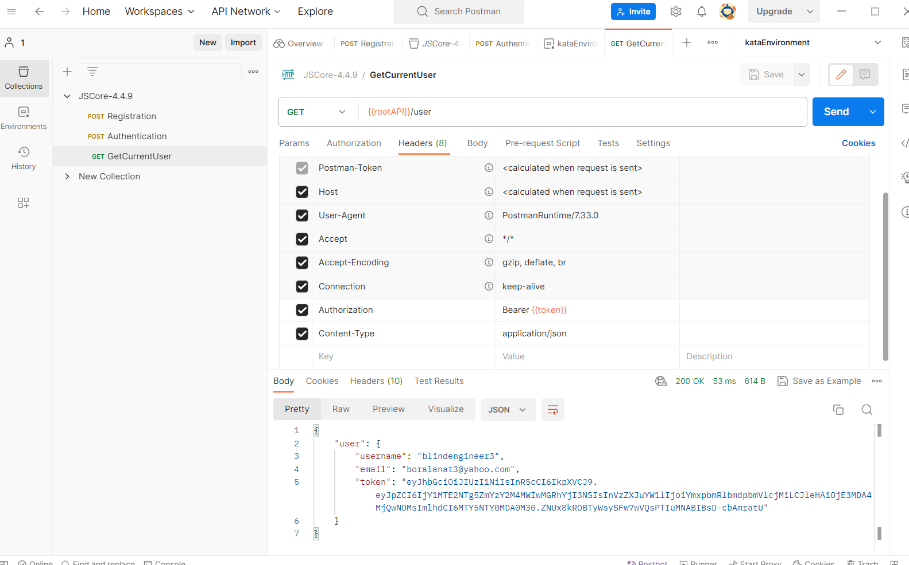

# JSCore-4.4.9
Postman functionality

## 1. Регистрация
### Создаем окружение. В нем создаем переменную с корневым API:

### Создаем и отправляем запрос на регистрацию. Получаем ответ сервера:

## 2. Аутентификация
### При аутентификации будем сохранять токен в переменную:

### Отправляем запрос (логинимся). Получаем ответ сервера:

### Переменная приняла значение полученного токена:

## 3. Получение данных текущего пользователя
### Используем заголовки, отправляем запрос, получаем ответ:

